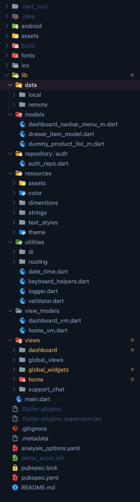

## GinzaXiaoma E-commerce App
GinzaXiaoma is a feature-rich e-commerce application developed using Flutter, GetX, and MVVM architecture. This project aims to provide a robust and scalable solution for building cross-platform mobile applications with a focus on a seamless user experience.

## Features
Flutter Framework: GinzaXiaoma is built using the Flutter framework, allowing for the development of beautiful and natively compiled applications for mobile, web, and desktop from a single codebase.

GetX State Management: The app leverages the GetX state management library, offering a simple and effective way to manage the state of the application. GetX provides powerful tools for dependency injection, navigation, and reactive programming.

MVVM Architecture: The project follows the Model-View-ViewModel (MVVM) architectural pattern, promoting a clean separation of concerns. This architecture enhances maintainability, testability, and scalability of the codebase.

Responsive UI: GinzaXiaoma is designed to provide a responsive user interface, ensuring a consistent and appealing experience across various screen sizes and orientations.

E-commerce Functionality: The app includes essential e-commerce features such as product listing, product details, cart management, and user authentication. Users can seamlessly browse products, add them to the cart, and complete the purchase process.

Localization: GinzaXiaoma supports localization, allowing for the adaptation of the app to different languages and regions.

## Getting Started
To run GinzaXiaoma locally, follow these steps:

Clone the Repository:

```
git clone https://github.com/your-username/GinzaXiaoma.git
Navigate to the Project Directory:
```

```
cd GinzaXiaoma
Install Dependencies:
```

```
flutter pub get
Run the App:
```

```
flutter run
Make sure you have the Flutter SDK installed on your machine before proceeding.
```

<table align="center" style="margin: 0px auto;">
  <tr>
    <td></img></td>
  </tr>
</table>

## File Pattern Inside The `lib` Folder

</img>

```
    lib/
    ├── data/
    │   └── ...
    ├── models/
    │   └── ...
    ├── repository/
    │   └── ...
    ├── resources/
    │   ├── ...
    ├── utilities/
    │   ├── ...
    ├── view_models/
    │   ├── ...
    ├── views/
    │   ├── ...
    └── main.dart
```

## App Demo

<table align="center" style="margin: 0px auto;">
  <tr>
    <th>On an iPhone 15 pro Simulator</th>
  </tr>
  <tr>
    <td align="center"></img></td>
  </tr>
</table>

## Download the apk at:
- 
